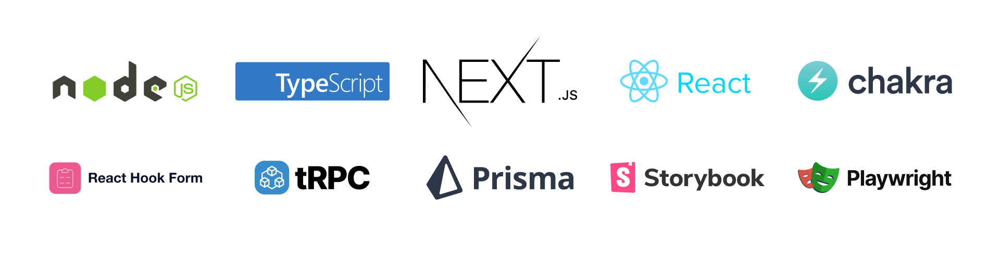

## Abrico assessment 
🚀 This repo is the nutshell of our actual technical stack. 

This repo is based on  the frontend starter repo Start UI: see the [documentation](https://docs.web.start-ui.com). The documentation contains all the necessary information on installation, usage, and some guides.

## Goal

The goal of this assessment is to get a sense of how quickly you adapt your skills to our tech stack and how to define and implement a technical solution given a product requirement. 

## Technologies

<div align="center" style="margin: 0 0 16px 0"></div>

[🟦 TypeScript](https://www.typescriptlang.org/), [⚛️ React](https://react.dev/), [⚫️ NextJS](https://nextjs.org/), [⚡️ Chakra UI](https://chakra-ui.com/),  [🟦 tRPC](https://trpc.io/), [▲ Prisma](https://www.prisma.io/), [🏖️ TanStack Query](https://react-query.tanstack.com/), [📕 Storybook](https://storybook.js.org/), [🎭 Playwright](https://playwright.dev/), [📋 React Hook Form](https://react-hook-form.com/)
, [🌍 React i18next](https://react.i18next.com/)


## Requirements

- [NodeJS](https://nodejs.org/) >=20
- [Pnpm](https://pnpm.io/)
- [Docker](https://www.docker.com/) (or a [PostgreSQL](https://www.postgresql.org/) database)


2. Install dependencies
```bash
pnpm install
```

3. Setup and start the db with docker
### Run DB in docker
```bash
docker run -d \
  --name postgres-db \
  -e POSTGRES_USER=postgres \
  -e POSTGRES_PASSWORD=postgres \
  -e POSTGRES_DB=postgres \
  -p 5432:5432 \
  postgres
```

### Connect Prisma to the DB
```bash
pnpm prisma db push
```

### Initialize docker
```bash
pnpm dk:init
```


## Development

```bash
# Run the database in Docker (if not already started)
pnpm dk:start
# Run the development server
pnpm dev
```


## Show hint on development environments

Setup the `NEXT_PUBLIC_ENV_NAME` env variable with the name of the environment.

```
NEXT_PUBLIC_ENV_NAME="staging"
NEXT_PUBLIC_ENV_EMOJI="🔬"
NEXT_PUBLIC_ENV_COLOR_SCHEME="teal"
```

## Translations

### Setup the i18n Ally extension

We recommended using the [i18n Ally](https://marketplace.visualstudio.com/items?itemName=lokalise.i18n-ally) plugin for VS Code for translations management.

Create or edit the `.vscode/settings.json` file with the following settings:

```json
{
  "i18n-ally.localesPaths": ["src/locales"],
  "i18n-ally.keystyle": "nested",
  "i18n-ally.enabledFrameworks": ["general", "react", "i18next"],
  "i18n-ally.namespace": true,
  "i18n-ally.defaultNamespace": "common",
  "i18n-ally.extract.autoDetect": true,
  "i18n-ally.keysInUse": ["common.languages.*"]
}
```

